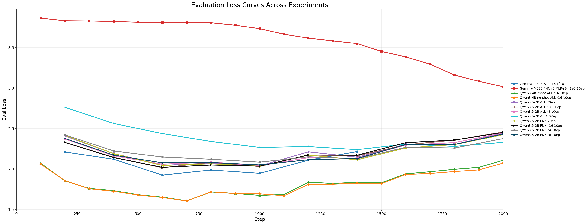
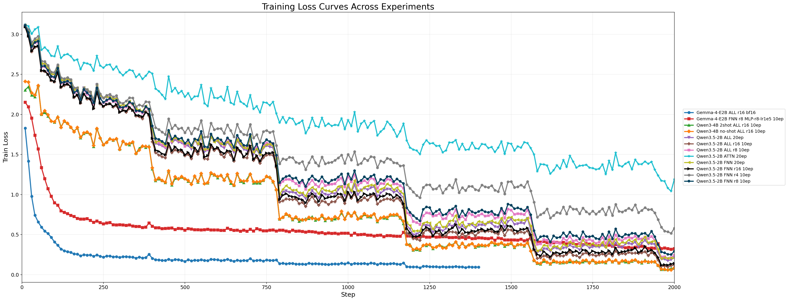

# LahjaMT: English-to-Arabic Context-Aware Dialect Machine Translation

This repository contains experiments and comparisons of baselines behavior and LoRA adaptation for  **English → Arabic dialect machine translation**, with the broader goal of building and evaluating context-aware translation systems for dialectal Arabic.

The current experiments focus on the **Egyptian Arabic (EG) subset**, but the intended direction is broader English-to-dialectal-Arabic MT.

## Task

Given an English dialogue turn, optionally with previous dialogue context and metadata, the model generates a natural Arabic dialect translation.

The current prompt style is:

```text
Translate into natural Egyptian Arabic dialect.
Do not use Modern Standard Arabic unless unavoidable.
Return only the Arabic translation.
```

For now, the evaluated dialect is **Egyptian Arabic**, but the same framework is to be extended to the rest of dialects.

## Current Evaluation Setup

The current reported results are on the **English → Egyptian Arabic EG subset**.

```text
Eval examples: 1118
Metrics: BLEU, chrF, chrF++
```

Best systems are compared against each other:

* Gemma-4-E2B-it baseline without fine-tuning
* Gemma-4-E2B-it LoRA fine-tuned on MLP/FNN modules with rank 8
* Qwen3.5-2B LoRA fine-tuned with all-module LoRA rank 16
* Qwen3.5-2B baseline without fine-tuning

- More experiments are in the notebooks

## Results on EG Subset (1118 samples ordered by spBLEU)


| System                                      | BLEU | spBLEU | chrF | chrF++ | Semantic Similarity |
| ------------------------------------------- | ---: | -----: | ---: | -----: | ------------------: |
| Task Baseline: UBC-NLP/NileChat-3B-Base-LoRA-r16 | ... | **26.85** | ... | **41.45** | ... |
| Gemma-4-E2B-it Base                         | **14.55** | **26.85** | **44.96** | **41.91** | **0.952464** |
| Gemma-4-E2B-it FNN-r8 MLP                   | 13.37 | 25.23 | 43.16 | 40.14 | 0.949918 |
| Qwen3-4B LoRA Base 2shot all-r16            | 10.11 | 19.70 | 38.16 | 35.44 | 0.944603 |
| Qwen3-4B LoRA Base zero-shot prompting all-r16 | 9.83 | 19.52 | 37.89 | 35.05 | 0.944039 |
| Qwen3.5-2B LoRA all-r16                     | 8.56 | 18.59 | 37.91 | 34.57 | 0.943186 |
| UBC-NLP/NileChat-3B  | 7.04 | 14.82 | 32.53 | 29.44 | 0.923868 |
| Qwen3-4B instruct few-shot prompting        | 3.19 | 9.85 | 28.44 | 25.11 | 0.929894 |
| Qwen3-4B Base                               | 2.59 | 8.10 | 26.77 | 23.48 | 0.924230 |
| Qwen3.5-2B Base                             | 2.37 | 7.81 | 26.52 | 23.24 | 0.923324 |
| Qwen3-4B Base few-shot prompting            | 2.33 | 7.36 | 25.91 | 22.80 | 0.920058 |


### Evaluation Metrics

### BLEU

BLEU measures how much the generated translation overlaps with the reference translation at the word n-gram level. It mainly rewards exact word/phrase matches and applies a brevity penalty to avoid overly short translations.

Higher BLEU is better.

---
### spBLEU

spBLEU, or SentencePiece BLEU, is a BLEU variant that first tokenizes the generated translation and the reference using a SentencePiece subword tokenizer, then computes the standard BLEU score on these subword tokens. It is useful for multilingual and morphologically rich translation tasks because it avoids depending only on whitespace-based word tokenization.

Higher spBLEU is better.

```math
\mathrm{spBLEU}
=
\mathrm{BP}
\cdot
\exp
\left(
\sum_{n=1}^{N} w_n \log p_n
\right)
```

where:

- $\mathrm{BP}$ is the brevity penalty.
- $p_n$ is the modified precision for SentencePiece-tokenized $n$-grams.
- $w_n$ is the weight for each $n$-gram order, commonly uniform.
- $N$ is usually 4, as in standard BLEU.

The brevity penalty is:

```math
\mathrm{BP} =
\begin{cases}
1, & c > r \\
\exp\left(1 - \frac{r}{c}\right), & c \le r
\end{cases}
```

where:

- $c$ is the generated translation length.
- $r$ is the reference translation length.

---

### chrF

chrF is a character n-gram F-score between the generated translation and the reference. It is useful for Arabic and other morphologically rich languages because it can reward partial word overlap even when exact word matching fails.

Higher chrF is better.

```math
\mathrm{chrF}_{\beta}
=
\frac{(1+\beta^2)\cdot \mathrm{chrP}\cdot \mathrm{chrR}}
{\beta^2\cdot \mathrm{chrP}+\mathrm{chrR}}
```

where:

- $\mathrm{chrP}$ is character n-gram precision.
- $\mathrm{chrR}$ is character n-gram recall.
- $\beta$ is the recall weight, commonly $\beta=2$.

---

### chrF++

chrF++ extends chrF by using both **character n-gram matching** and **word n-gram matching**.
It keeps the flexibility of character-level evaluation while adding sensitivity to word-level correctness.

Higher chrF++ is better.

```math
\mathrm{chrF}^{++}_{\beta}
=
\frac{(1+\beta^2)\,P_{++}\,R_{++}}
{\beta^2 P_{++}+R_{++}}
```

An example of using 6-gram on character level and 2-gram on the word level:

```math
P_{++}
=
\frac{
\sum_{n=1}^{6} P_{\text{char},n}
+
\sum_{n=1}^{2} P_{\text{word},n}
}
{8}
```

```math
R_{++}
=
\frac{
\sum_{n=1}^{6} R_{\text{char},n}
+
\sum_{n=1}^{2} R_{\text{word},n}
}
{8}
```

```math
\mathrm{chrF}^{++}_{\beta}
=
\frac{(1+\beta^2)\,P_{++}\,R_{++}}
{\beta^2 P_{++}+R_{++}}
```

where:

- $P_{\text{char},n}$ is the precision for character n-grams of order $n$.
- $R_{\text{char},n}$ is the recall for character n-grams of order $n$.
- $P_{\text{word},n}$ is the precision for word n-grams of order $n$.
- $R_{\text{word},n}$ is the recall for word n-grams of order $n$.
- $P_{++}$ and $R_{++}$ are the averaged precision and recall over both character and word n-grams.
- $\beta$ controls the importance of recall, commonly $\beta = 2$.


---

### Semantic Similarity

Semantic similarity measures how close the generated translation and the reference are in embedding space. Unlike BLEU and chrF, it can capture meaning similarity even when the wording is different.

In these experiments, semantic similarity is computed using E5-large embeddings and cosine similarity.

Higher semantic similarity is better.

```math
\mathrm{similarity}
=
\cos\left(\mathbf{e}_{\mathrm{pred}},\mathbf{e}_{\mathrm{ref}}\right)
```

where:

- $\mathbf{e}_{\mathrm{pred}}$ is the embedding of the generated translation.
- $\mathbf{e}_{\mathrm{ref}}$ is the embedding of the reference translation.

Cosine similarity is computed as:

```math
\cos\left(\mathbf{e}_{\mathrm{pred}},\mathbf{e}_{\mathrm{ref}}\right)
=
\frac{\mathbf{e}_{\mathrm{pred}}\cdot\mathbf{e}_{\mathrm{ref}}}
{\left\lVert\mathbf{e}_{\mathrm{pred}}\right\rVert\left\lVert\mathbf{e}_{\mathrm{ref}}\right\rVert}
```

## Learning Curves

The following curves compare the training dynamics of the tested LoRA fine-tuning experiments at 2,000 steps.

### Evaluation Loss



### Training Loss



